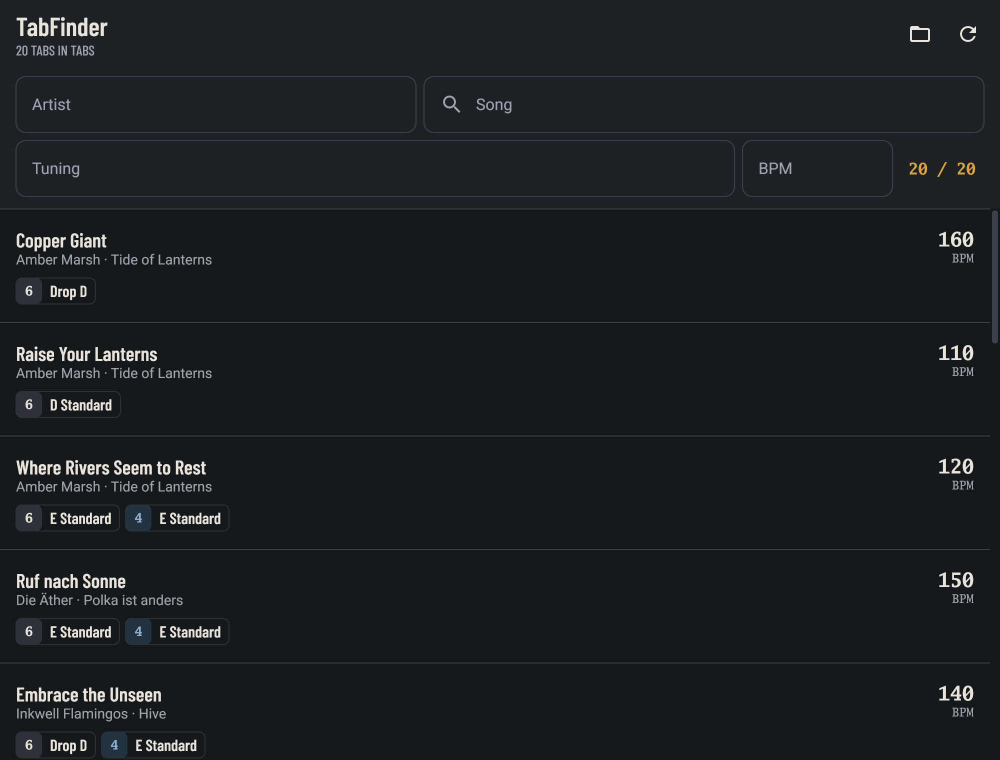
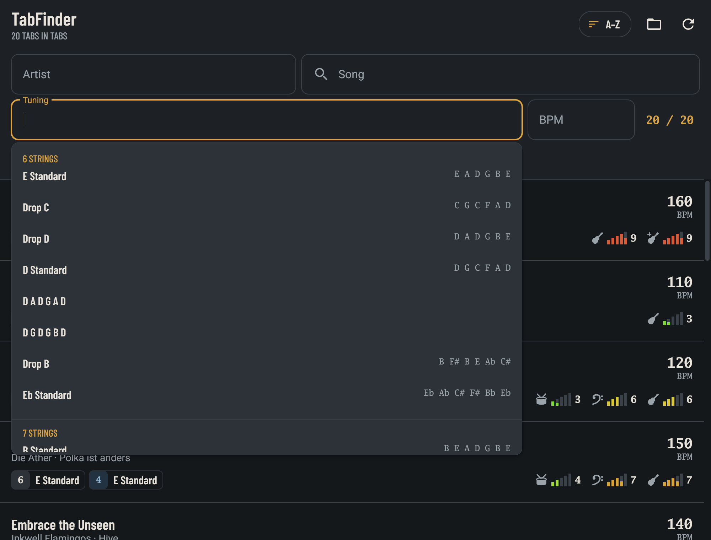
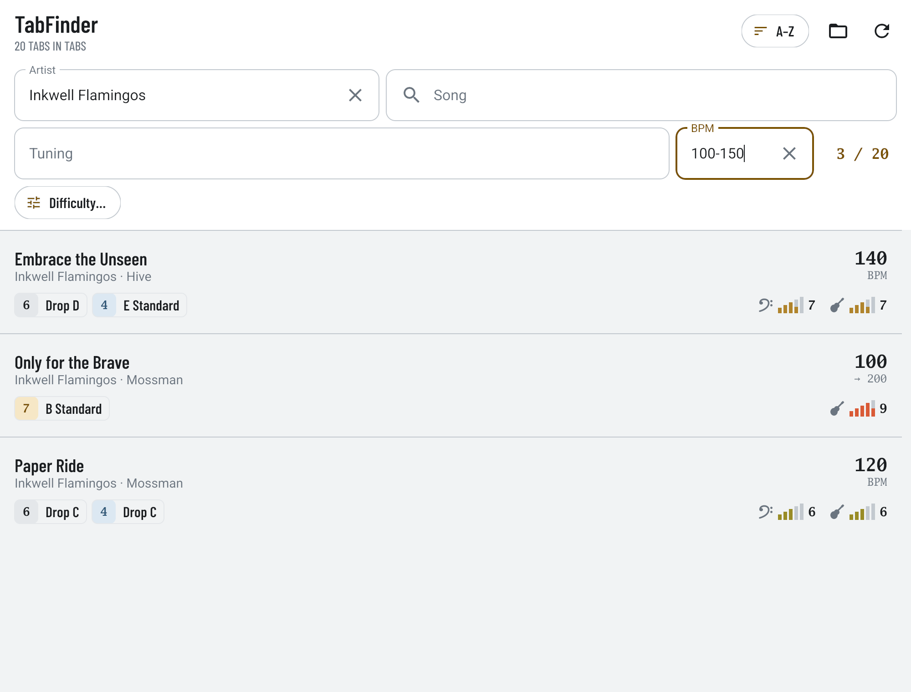
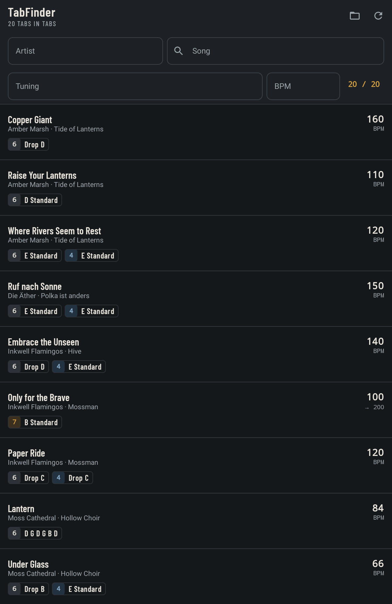
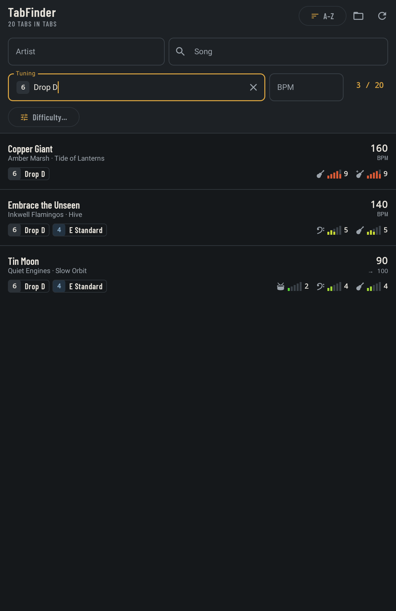

# TabFinder

Find guitar tabs by artist, song, tuning and tempo, and open them in TuxGuitar.
TabFinder reads the metadata inside the tab files themselves (title, artist, album,
tracks, tunings, tempo changes). When a file doesn't have that metadata, it falls back
to the folder layout and the file name.

<p align="center">
  
</p>

| Tuning suggestions from your library | Artist and BPM range filters (light theme) |
|---|---|
|  |  |

| Android | Android, filtered to Drop D |
|---|---|
|  |  |

All artists, albums and songs in the screenshots are made up.

There are four programs, all built on the same Go core:

| Program | Path | What it is |
|---|---|---|
| `tabfinder` | `cmd/tabfinder` | Desktop app (Gio): filter your library and open songs in TuxGuitar |
| Android app | `android/` | The same app for Android 10+ (Kotlin, Compose), backed by a bundled `tabscan` |
| `tabscan` | `cmd/tabscan` | CLI: list and filter tabs as TSV or JSON; `-serve` answers the Android app |
| `tabreorg` | `cmd/tabreorg` | CLI: move a messy collection into `<Artist>/<Album>/<Song>.<ext>` |

## Install

Download from [Releases](https://github.com/sbradl/tabfinder/releases/latest):

- **Android** (`tabfinder-<version>.apk`): open it on the device and allow installing from
  that source. Needs Android 10 or later (arm64). Opening songs needs
  [TuxGuitar](https://github.com/helge17/tuxguitar) for Android.
- **Linux desktop** (`tabfinder-<version>-linux-amd64.tar.gz`): unpack it and run
  `./install.sh`, which installs to `~/.local/bin` and adds a menu entry. It needs
  `tuxguitar` and either `kdialog` or `zenity`.
- **CLI tools** (`tabfinder-cli-<version>-<os>-<arch>`): `tabscan` and `tabreorg` for
  Linux, macOS and Windows. These are single binaries with no dependencies.

`SHA256SUMS` lists the checksums of all files.

## Supported files

Guitar Pro 3–7 (`.gp3`, `.gp4`, `.gp5`, `.gpx`, `.gp`, `.gtp`), TuxGuitar (`.tg`) and
Power Tab (`.ptb`). Files are recognized by their content, not their extension, so
misnamed files (a GP5 saved as `.gp3`), leftover `.crdownload` downloads and `.zip`
archives holding a single tab are read too.

## Setup

The toolchain is managed with [mise](https://mise.jdx.dev): Go, Java 21 and the Android SDK.

```sh
mise run setup        # install the toolchain and the Android SDK packages
```

You only need Go for the desktop app and the CLIs. The Android app also needs Java and the
SDK.

## Desktop app

```sh
mise run desktop          # run it from the source tree
mise run desktop-install  # build into ~/.local/bin/tabfinder and add a menu entry
```

On first start, choose your tab folder. The folder dialog needs `kdialog` or `zenity`.
Type into the artist, song, tuning and BPM fields to filter the list; the artist and
tuning fields suggest values from your library. Click a song to open it in `tuxguitar`,
which must be on your `PATH`. Songs whose file name TuxGuitar can't open are copied into
the cache under a name it can open.

| File | Contents |
|---|---|
| `~/.config/tabfinder/config.json` | `{"root": "<tab folder>"}` |
| `~/.cache/tabfinder/index.jsonl` | The last scan (`tabscan -json` format) |

`XDG_CONFIG_HOME` and `XDG_CACHE_HOME` are respected.

## Android app

```sh
mise run launch   # build the release APK, install it on the connected device and start it
```

The app asks for access to all files, then for your tab folder. It scans the folder
with `tabscan`, which is cross-compiled for arm64 and bundled as
`libtabscan.so` (`mise run bin`). Tapping a song opens it in the TuxGuitar Android app
(`app.tuxguitar.android.application`).

Use the release build (`mise run apk`). Debug builds are noticeably slower when scrolling.

## tabscan

```sh
mise run cli   # builds ./tabscan and ./tabreorg

tabscan ~/Guitar/Tabs                                 # TSV: path, artist, album, title, tempo, instruments, tunings
tabscan -tuning "drop c" -bpm 100-140 ~/Guitar/Tabs   # filter
tabscan -json ~/Guitar/Tabs                           # one JSON object per file, with per-track details
```

The filters are `-name` (all words in the title or file name), `-artist`, `-tuning` (a
name such as `"eb standard"`, or notes such as `"D A D G A D"`) and `-bpm` (`120`,
`100-140`, `180-`, `-90`). `-root` sets the base folder used for the Artist/Album
fallback.

## tabreorg

```sh
tabreorg ~/Guitar/Tabs          # dry run: prints the plan, writes <root>-reorg-summary.md
tabreorg -apply ~/Guitar/Tabs   # move the files
```

By default, `tabreorg` only prints what it would do. With `-apply`, it moves the files
and writes a move log (`<root>-moves-<time>.tsv`) and an undo script
(`<root>-undo-<time>.sh`) next to the root. The options are:

- `-rename=false` keeps the file names instead of naming each tab after its song.
- `-skip dirs` leaves the listed folders untouched.
- `-summary file` writes the summary somewhere else.
- `-config file` reads a different config file.

Settings that depend on your own library are kept in `~/.config/tabreorg/config.json`
rather than in the code:

```json
{
  "skip": ["Lessons"],
  "albumAliases": {"Moonbreder": "Moonbreeder"},
  "junkAlbums": ["unknown", "untitled.*"],
  "junkArtists": ["various"],
  "fileSuffixes": ["withbass"]
}
```

The patterns are regular expressions and ignore case. The file is optional.

## Development

```sh
mise run test          # Go tests, then the Android JVM tests
go test -race ./...
mise run test-device   # instrumented tests and perf check on a connected device
```

Desktop UI screenshots: `TABFINDER_SHOTS=<dir> go test ./cmd/tabfinder`. This needs a GPU;
without one, the screenshots are skipped.

The README's desktop screenshots come from `mise run screenshots`, which renders the app
offscreen with a made-up library (`cmd/tabfinder/readme_shots_test.go`). The Android
screenshots were taken from the debug build on a tablet, using the same library: set
`TABFINDER_README_LIBRARY=<dir>` when you run the test to write the library's files there.

### Releasing

1. Set `tabfinderVersion` in `android/gradle.properties` to the new version.
2. Move the entries under `[Unreleased]` in `CHANGELOG.md` into a new `## [X.Y.Z] - <date>`
   section.
3. Commit, then tag and push: `git tag vX.Y.Z && git push origin main vX.Y.Z`.

The release workflow checks the version, builds everything and publishes the release, using
the changelog section as its notes. The APK is signed with the release key, which is stored in
the repository secrets `TABFINDER_KEYSTORE_BASE64` and `TABFINDER_KEYSTORE_PASSWORD`. Local
release builds use the same key when `~/.gradle/gradle.properties` sets `tabfinderKeystore`
and `tabfinderKeystorePassword`; without them, they're signed with the debug key.

All test data is made up: no real bands, songs or tabs. See
[docs/test-plan.md](docs/test-plan.md) for the fixtures, the conventions and what is covered.

| Package | Role |
|---|---|
| `internal/tab` | Parsing, tunings, tempos, path fallbacks, parallel scan |
| `internal/finder` | Song list, filters, search, suggestions, index file |
| `internal/rows` | What the apps show for each song; the JSON shapes of `tabscan -serve` |
| `internal/tuxguitar` | File names TuxGuitar can open |
| `internal/tabfiles` | Builds the test fixtures |
